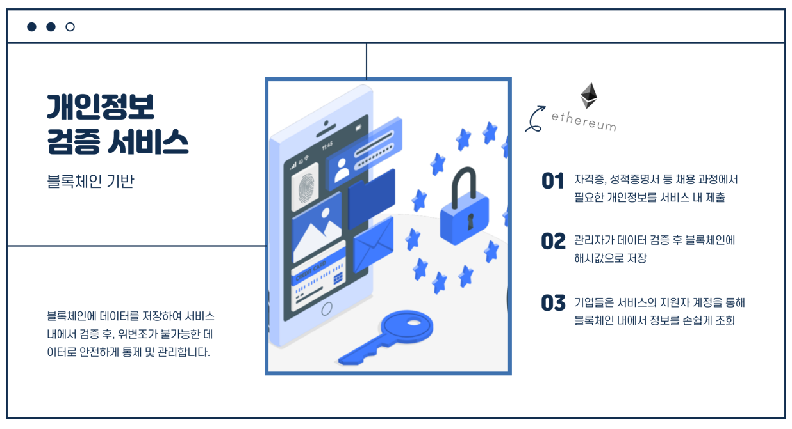

# :card_file_box: Blocket

## 목차

1. [프로젝트 소개](#mag-프로젝트-소개)
2. [Git](#octocat-git)
3. [컨벤션 규칙](#pushpin-컨벤션-규칙)
4. [애플리케이션 배포](#speaker-애플리케이션-배포)

# :mag: 프로젝트 소개

## :sparkles: 주제

### 블록체인 기반 개인정보 검증 서비스

## :monocle_face: 개요

    채용 지원시, 구직자가 각 기업의 채용 절차상 동일한 증명자료(졸업증명서, 성적증명서 등)를
    각각 제출함에 따라 부담이 가중되고 불필요한 사회적 비용이 발생하는 문제를 해결

## :triangular_flag_on_post: 기대효과

### 1. 개인의 반복 절차 최소화

    서비스에 저장된 정보를 채용 과정에 활용

### 2. 최적의 블록체인 플랫폼 서비스 제공

    개인은 개인정보를 저장하고, 관리자 검증 후 기업은 신뢰성 있는 정보를 제공받음

### 3. 기업의 채용 절차 최소화

    기업의 효율성 개선과 비용 절감 및 리스크 완화

## :wrench: 기술 스택

### 백엔드/서버

- 
- 
- 
- 
- 
- 
- 
- 
- 
- 
- 

### 프론트엔드

- 
- 
- 
- 
- 
- 

### 블록체인

- 

- 

## :computer: 개발 환경

### 협업

- 

- 

- 

- 

- 

### 백엔드/서버

`openjdk version 12`

`IntelliJ IDEA 2021.1.3 x64`

`sts-3.9.14.RELEASE`

`MariaDB 10.5`

`DBeaver 21.2.0`

`Ubuntu 20.04 LTS`

`jenkins`

`docker`

### 프론트엔드

`node 14.17.5`

`npm 6.14.13`

`Vue cli `

`Vue`

## :hammer: 시스템 아키텍처

## 🧐 팀원 소개

| Name     | 임현우                                                          | 조웅현                                                          | 정세원                                                          | 노효진                                                          | 안창호                                                          |
| :------- | :-------------------------------------------------------------- | :-------------------------------------------------------------- | :-------------------------------------------------------------- | :-------------------------------------------------------------- | :-------------------------------------------------------------- |
| Position | FrontEnd & UI/UX                                                | FrontEnd & UI/UX & Block Chain                                  | BackEnd Develop                                                 | BackEnd Develop                                                 | BackEnd Develop & CI/CD                                         |

## :dizzy: 주요 기능

# 🦨 Git

## :twisted_rightwards_arrows: Git 워크플로우

---

- master : 공식 릴리즈 기록 브랜치
- develop : 출시할 버전 개발 브랜치
- feature : 기능 개발 브랜치

### 1. master에서 develop를 생성 및 푸시

    git branch develop

    git push -u origin develop

### 2. feature 브랜치 생성

- feature 브랜치 생성

        git checkout develop
        git checkout -b feature/be/new_feature_name

- develop 브랜치로 병합 후 삭제

        git checkout develop
        git merge feature/be/new_feature_name
        git branch -D feature/be/new_feature_name

## :speech_balloon: Git 컨벤션

### Git 커밋 메시지

    git commit -m "[#관련 Jira 이슈 번호] [Git 커밋 타입] : [Commit 메시지]"

### 커밋 타입

| 태그 이름 | 설명                                                  |
| :-------- | :---------------------------------------------------- |
| Feat      | 새로운 기능을 추가할 경우                             |
| Fix       | 버그를 고친 경우                                      |
| Style     | 코드 포맷 변경, 세미 콜론 누락, 코드 수정이 없는 경우 |
| Refactor  | 프로덕션 코드 리팩토링                                |
| Test      | 테스트 추가, 테스트 리팩토링(프로덕션 코드 변경 X)    |
| Docs      | 문서를 수정한 경우                                    |
| Rename    | 파일 혹은 폴더명을 수정하거나 옮기는 작업만인 경우    |
| Remove    | 파일을 삭제하는 작업만 수행한 경우                    |

### Branch 명명 규칙

    feature/be or fe/기능

<!-- ### 백엔드, 프론트 패키지 구성 -->

# :speaker: 애플리케이션 배포

   [포팅매뉴얼](https://lab.ssafy.com/s05-blockchain/S05P21B101/-/blob/master/exec/%ED%8F%AC%ED%8C%85_%EB%A7%A4%EB%89%B4%EC%96%BC.pdf)

