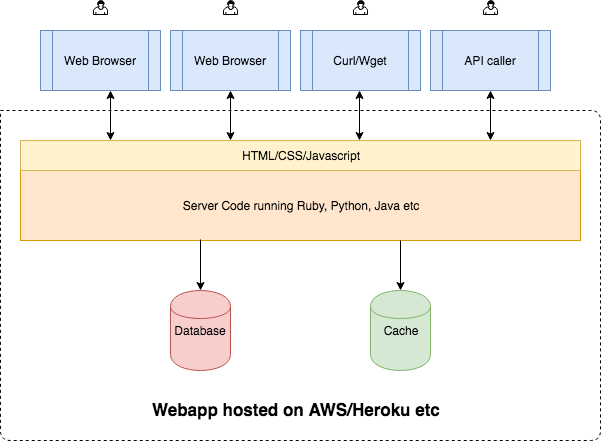
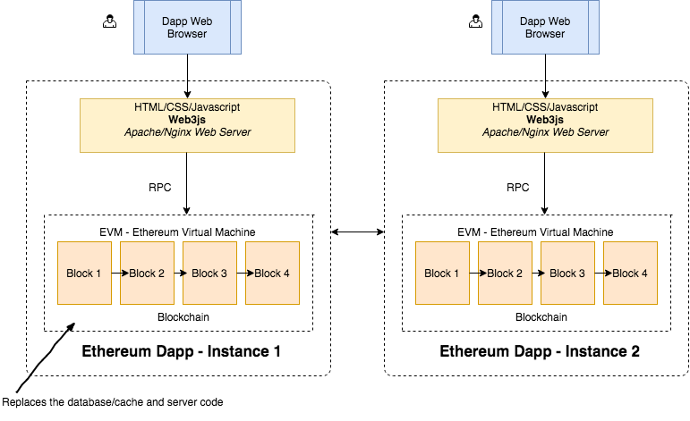

# 1.1 무척 간단한 강의 소개

생성일: 2021년 9월 1일 오후 4:00

이더리움 블록체인에서 탈중앙화 애플리케이션(Decentralized App, dApp)을 개발하는 것에 관심있는 모두를 위한 기초 내용을 담았다. 

## 1.2 지불(payment), 그 이상을 향해

비트코인 블록체인의 경우 : 은행과 같은 중앙 기관의 중재 없이 블록체인의 다양한 당사자 간에 돈을 송금하는데 사용된다.

**비탈릭 부테린**은 이러한 탈중앙화의 개념을 송금 외에 다른 분야에 적용하고자 하였다. **중앙화된 통제 권한 없이 전 세계적으로 운영될 수 있는 응용프로그램**을 만들고 싶어했다.

ex) 페이스북의 경우 페이스북 주식회사가 사용자의 데이터를 소유하고 있으며, 원하면 사용자의 계정을 제거할 수 있는 권리를 가진다. 10년 뒤 페이스북이 폐쇄된다고 가정하면 모든 데이터가 손실될 수도 있다.

## 1.3 세계의 컴퓨터

이더리움은 Public BlockChain 기반의 **분산 컴퓨팅 플랫폼**이다. 전세계의 수많은 컴퓨터로 구성된 하나의 큰 컴퓨터로 생각할 수도 있다. 응용 프로그램을 작성하고 글로벌 컴퓨터에서 이를 실행할 수도 있으며, 이 플랫폼은 중단 시간, 검열, 사기 또는 제 3자의 간섭없이 항상 실행되도록 보장한다. **응용 프로그램(추후에 Smart Contract로 설명할 것이다.)을 실행**하는 것 이외에도, 이더리움 블록체인을 통해 **중앙 권한 없이 두 당사자 간에 돈을 이체**할 수도 있다.

이러한 모든 컴퓨터(node라고 함)는 서로 연결되어 있으며, **코드와 데이터의 전체 복사본**을 가지고 있다. 이더리움 블록체인에 코드를 배포하면 코드가 네트워크의 모든 노드로 복제된다. 응용 프로그램에 데이터가 저장되면 모든 노드에서 해당 데이터가 복제된다. 네트워크에는 수천 개의 노드가 있으며 모든 노드를 중지시키는 것은 거의 불가능하다. 따라서 응용 프로그램에 항상 액세스할 수 있다. 

## 1.4 웹앱 아키텍쳐

이더리움을 이해하는 가장 좋은 방법 중 하나는 바로 기존의 client - Server architecture와 비교하는 것이다. 웹 개발자라면 이를 알고 있을 것이다. 

- 서버 코드는 java, python, ruby, C# 등의 언어를 통해 구현된다.
- 프론트엔드 코드는 HTML, CSS, js를 사용하여 구현된다.
- 전체 애플리케이션은 AWS, Microsoft Azure, Google Cloud Platform, Heroku, VPS와 같은 호스팅 업체를 통해 호스팅된다.
- 사용자는 웹 브라우저, curl/wget 또는 API를 통해 클라이언트를 통해 웹 응용 프로그램과 상호작용한다. → **중앙화된 하나의 웹 응용 프로그램이 있으며 모든 클라이언트가 이 응용 프로그램과 상호작용한다.**

## 1.5 이더리움 아키텍쳐

이제 이러한 웹 애플리케이션의 client - server 아키텍쳐와 비교하여 살펴보자.

- 그림에서 알 수 있듯이, 모든 클라이언트(브라우저)는 응용 프로그램의 자체 인스턴스와 통신한다. → **모든 클라이언트가 연결할 중앙 서버가 존재하지 않는다.**
- 즉 이상적인 탈중앙화 세계에서, Dapp과 상호작용하려는 모든 사람은 컴퓨터/스마트폰 등의 기기에 실행중인 블록체인의 전체 복사본이 필요하다. 즉 애플리케이션을 사용하려면 먼저 전체 블록체인을 다운로드한 다음 애플리케이션 사용을 시작해야 한다.
- 하지만 우리가 사는 세계는 이상적인 세계가 아니기에, 모든 사람들이 이러한 앱을 사용하기 위해 블록체인 서버를 운영할 것으로 기대하는 것은 무리가 있다. **하지만 탈중앙화의 배경은 단일/중앙화된 서버에 의존하지 않는 것**이다. 이를 위해 제시된 몇 가지 솔루션(Metamask 등)을 사용하면 HDD와 RAM을 많이 사용하지 않아도 블록체인의 전체 복사본을 다운로드하고 실행하면서도 탈중앙화를 훼손하지 않을 수 있다.

이더리움 블록체인은 정확히 무엇일까? 블록체인에는 2가지 구성요소가 존재한다.

1. 데이터베이스: 네트워크의 모든 트랜잭션은 블록체인에 저장된다. 응용 프로그램을 배포하는 행위 또한 트랜잭션으로 간주된다. 후보자 투표를 위한 투표 응용 프로그램을 예로 들면, 하나하나의 투표가 트랜잭션으로 간주된다. 이러한 모든 트랜잭션은 공개되며 누구나 볼 수 있고 확인할 수 있다. 또한 이 데이터는 절대 조작할 수 없다. 네트워크의 모든 노드에 동일한 데이터 복사본이 있는지 확인하고, 유효하지 않은 데이터가 이 데이터베이스에 기록되지 않도록 하기 위해 이더리움은 작업증명(proof of Work)이라는 알고리즘을 사용하여 네트워크를 보호한다.
2. 코드: 블록체인의 데이터베이스 요소는 트랜잭션을 저장한다. 그렇다면 투표 응용 프로그램에서 투표에 대한 모든 논리(로직)는 어디에 담길까? 이더리움 세계에서는 Solidity라는 언어로 논리/응용 프로그램 코드(스마트 계약)를 작성한다. 그런 다음 솔리디티 컴파일러를 사용하여 이더리움 바이트코드로 컴파일한 다음 해당 바이트 코드를 블록체인에 배포한다. 따라서 이더리움 블록체인은 트랜잭션을 저장할 뿐만 아니라 스마트 계약 코드를 저장하고 실행한다. 

즉 기본적으로 블록체인은 데이터를 저장하고, 코드를 저장하며 코드를 EVM에서 실행한다.