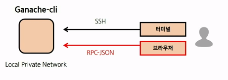
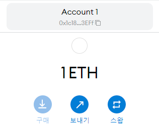

# Day1 - 블록체인 네트워크의 이해

생성일: 2021년 8월 24일 오후 3:42

## 1. 이더리움 블록체인 네트워크의 분류

**프라이빗 네트워크**와 **퍼블릭 네트워크**로 분류할 수 있다.

✔ 퍼블릭 네트워크 : 전세계에서 공용하는 것으로, 한번 저장된 데이터는 불가역적으로 저장된다.

✔ 프라이빗 네트워크의 경우, 로컬 환경에서 동작하기 때문에 불가역적으로 데이터가 저장되지는 않는다.

→ 퍼블릭 네트워크의 경우 메인넷, 테스트넷으로 구별할 수 있다. 

## 2. 이더리움 네트워크 개념도

노드 : 수많은 이더리움에 들어있는 데이터를 모두 동기화하여, 동일하게 가지고 있는 것. 우리는 이 노드를 직접 운영할 수 있다. 데이터는 블록의 형태로 가지고 있다.

연결 : 

블록 : 

이더리움에 참여하기 위해선, 이더리움 클라이언트가 필요하다. 일반적으로 `geth`를 사용한다.

## 3. 환경 설정

1. Chocolatey 설치

🤔 `Chocolatey 란?` : **소프트웨어 설치 툴이다. 설치하려는 윈도우용 소프트웨어를 일일이 웹사이트에서 찾아서 설치할 필요 없이, 간단하게 커맨드 만으로 윈도우용 소프트웨어를 설치할 수 있게 도와준다.**

이제 `github` , `golang` , `mingw` 를 설치해 보자.

```powershell
choco install git -y
choco install golang -y // geth가 golang으로 되어 있다.
choco install mingw -y
```

🤔 -y 옵션은 yes 항목에 대해 모두 자동으로 입력하겠다는 뜻이다.

1. Geth 설치
2. NodsJs 설치
3. ganache-cli 설치 후 버전 확인 
4. MetaMask 설치

**이제 metaMask를 설치하고 새로운 지갑을 생성해보자.**

이더리움 지갑을 생성함과 동시에, 256bit의 무작위 숫자가 생성된다. (개인키의 생성) → 64자리의 Hex 값으로 인코딩

타원곡선전자서명 알고리즘을 사용하여 공개키를 생성한다.

🤔 **비대칭키 암호화** : 디지털 서명을 위한 키(개인키)와, 복호화를 위한 키가 서로 다르다!

## 4. 로컬 네트워크 활용 및 실습

먼저 로컬 테스트넷을 구동해 보자.

```powershell
ganache-cli -d -m -p 7545 -a 5
```

- -d -m HD Waller 생성 시 니모닉 구문을 사용한다.
- -p 포트 번호를 설정한다.
- -a 구동 시 생성할 계정수를 지정한다. (기본 10개)

🤔 Gas Price란?

이제 Geth로 네트워크에 접속해 보자.  새로운 명령 프톰프트 창을 연 후, 다음을 실행한다.

```powershell
geth attach http://localhost:7545
```

이를 통해, `SSH` 를 통해 터미널에서 ganache-cli Local Private Network 환경에 접속되었다!

### 연결성 확인

```powershell
net.listening
net.peerCount
```

### 계정 목록 확인

```powershell
eth.accounts
```

### 계정 보유 잔액 확인

```powershell
web3.fromWei(eth.getBalance(eth.accounts[0]))
```

## 메타마스크를 통해 로컬 이더리움 블록체인 네트워크에 연결하자.

이를 위해 이전에 `RPC URL` 과 `chain ID` 를 알아야 한다.

→ RPC URL : `[http://localhost:7545](http://localhost:7545)` 

→ Chain ID : 터미널에서 `eth.chainId()` 를 통해 알 수 있다.

이제 메타마스크에서 맞춤형 RPC를 통해 내 로컬 네트워크에 연결할 수 있다.



이제 메타마스크 계정으로, Geth로 생성한 어카운트로 100ETH를 전송해 보자.

```powershell
tx = { from : "보낼계정", to: "받는계정", value: 1e18 }
eth.sendTransaction(tx)
```

이제 메타마스크를 확인해보면 정상적으로 ETH가 전달되었음을 확인할 수 있다.



또한 트랜잭션의 정보도 확인해볼 수 있다. 

```powershell
eth.getTransaction(transactionHash)
eth.getTransactionReceipt(transcationHash) 
```

이더리움을 보낸 후, 잔고 또한 확인해볼 수 있다.

```powershell
eth.getBalance(eth.accounts[0])
>> 98999580000000000000

web3.fromWei(eth.getBalance(eth.accounts[0]), "ether")
>> 98.99958
```

# 과제1 : geth console에서 데이터를 담은 트랜잭션 생성하기

1) sendTransaction을 사용하여 트랜잭션 보내기

2) `hello ethereum` 이라는 메시지가 포함되어야 한다.

3) API 호출 후 트랜잭션 처리 결과를 확인한다.

- 트랜잭션 상태 확인
- 트랜잭션 종결 후 "hello ethereum" 데이터 확인
- 보낸 주소의 잔고

# 과제2 : 에세이 작성

1. 많은 사람들이 블록체인에 기록된 데이터를 신뢰할 수 있다고 말하는데, 그 근거는?
2. 블록체인이 산업계에 미치는 영향을 언급하고, 이를 기반으로 한 응용 사례를 제시하세요

# 과제3 : 퍼블릭 네트워크인 Ropsten 테스트넷 활용

전제 조건: 동기화 폴더 생성

`C:\Users\{username}\` 아래에 workspace 폴더 생성

생성한 workspace 폴더로 이동한 후, workspace 폴더에 datadir 폴더를 생성한다. 이후 Geth 명령어로 계정을 생성한다.

```powershell
geth --datadir .\datadir\ account new
```

이후 테스트 이더를 받는다. 

[Ropsten Ethereum Faucet](https://faucet.ropsten.be/)

🤔 이를 위해 방화벽의 특정 포트 번호를 허용해야 한다.

방화벽 및 네트워크 보호 > 고급설정 > 인바운드 규칙 > 새 규칙 추가

- TCP 30303
- UDP 30303

🤔 롭슨 테스트넷에 참여하기

```powershell
geth --ropsten --datadir C:\Users\tofan\workspace\datadir\ --http --http.addr 0.0.0.0 -http.api eth,net,web3,personal --http.corsdomain * --allow-insecure-unlock
```

최종적으로 Geth에 접속한다.

```powershell
geth attach http://localhost:8545

# Geth console 내부
net.listening
eth.syncing
net.peerCount

# 동기화 진행을 숫자로 보고 싶은 경우, 아래와 같이 응용 가능하다.
eth.syncing.currentBlock / eth.syncing.highestBLock * 100
```

이더 잔고 확인

```powershell
eth.getBalance(eth.accounts[0])
# 동기화가 완료되어야만 1,000,000,000,000,000,000이 출력된다.
# 기본 단위는 Wei이다.
```